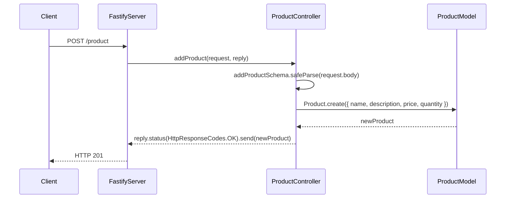
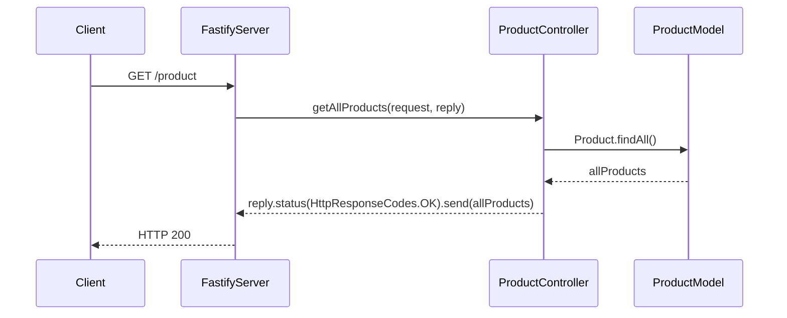
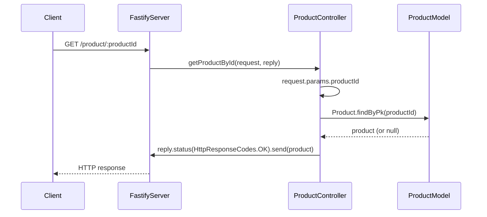
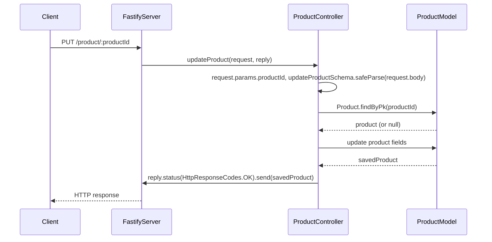

## Endpoints

### Create Product


#### API Details

- Endpoint: /product/
- Method: POST
##### Request Body:
```json
{
  "name": "apple",
  "price": 15.00,
  "description": "sweet green apple",
  "quantity": 6
}
```
##### Response:
```json
{
	"productId": 1,
	"name": "apple",
	"description": "sweet green apple",
	"price": "15.00",
	"quantity": 6,
	"updatedAt": "2024-06-23T10:07:17.474Z",
	"createdAt": "2024-06-23T10:07:17.474Z"
}
```

### Get All Products


#### API Details

- Endpoint: /product/
- Method: GET

##### Response:
```json
[
  {
    "productId": 1,
    "name": "apple",
    "description": "sweet green apple",
    "price": "15.00",
    "quantity": 6,
    "updatedAt": "2024-06-23T10:07:17.474Z",
    "createdAt": "2024-06-23T10:07:17.474Z"
  },
  {
    "productId": 2,
    "name": "pear",
    "description": "sweet green pear",
    "price": 12.00,
    "quantity": 3,
    "updatedAt": "2024-06-23T10:07:45.474Z",
    "createdAt": "2024-06-23T10:07:45.474Z"
  }
]
```

### Get Product By ID


#### API Details

- Endpoint: /product/:productId
- Method: GET

##### Response:
```json
{
	"productId": 1,
	"name": "apple",
	"description": "sweet green apple",
	"price": "15.00",
	"quantity": 6,
	"updatedAt": "2024-06-23T10:07:17.474Z",
	"createdAt": "2024-06-23T10:07:17.474Z"
}
```

### Update Product


#### API Details

- Endpoint: /product/:productId
- Method: PUT
##### Request Body:
```json
{
  "name": "red apple",
  "price": 16.00,
  "description": "sweet red apple",
  "quantity": 3
}
```
##### Response:
```json
{
    "productId": 1, 
    "name": "red apple",
    "price": "16.00",
    "description": "sweet red apple",
    "quantity": 3,
    "updatedAt": "2024-06-23T10:07:17.474Z",
    "createdAt": "2024-06-23T10:07:17.474Z"
}
```
