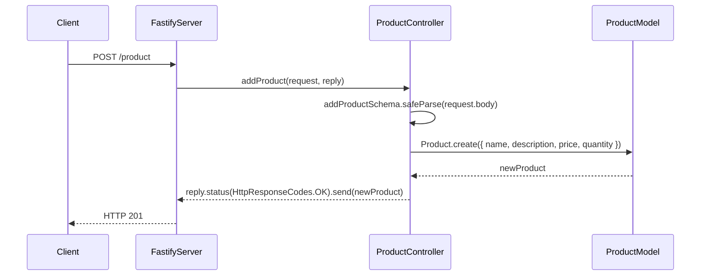
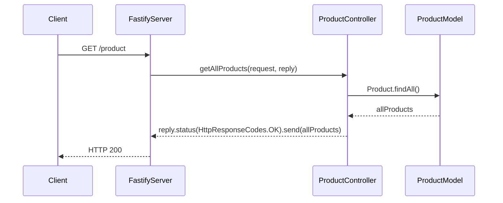
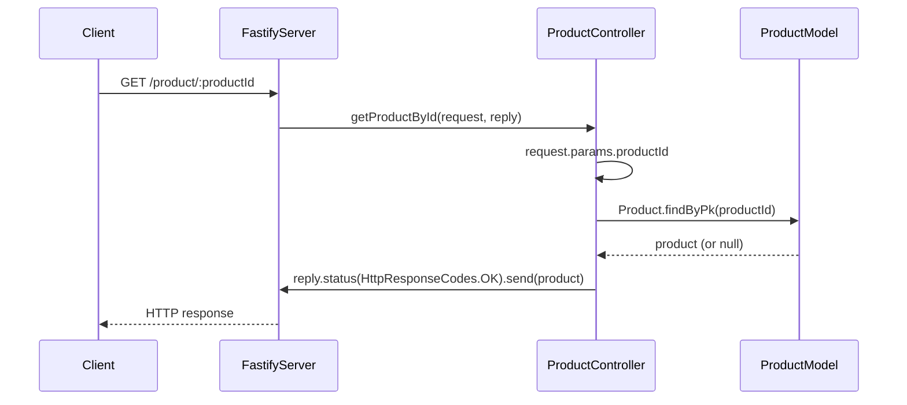
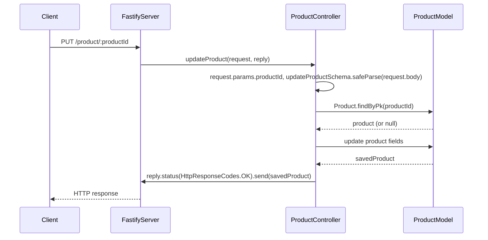

## Endpoints

### Create Product

```mermaid
sequenceDiagram
    participant Client
    participant FastifyServer
    participant ProductController
    participant ProductModel

    Client->>FastifyServer: POST /product
    FastifyServer->>ProductController: addProduct(request, reply)
    ProductController->>ProductController: addProductSchema.safeParse(request.body)
    ProductController->>ProductModel: Product.create({ name, description, price, quantity })
    ProductModel-->>ProductController: newProduct
    ProductController-->>FastifyServer: reply.status(HttpResponseCodes.OK).send(newProduct)
    FastifyServer-->>Client: HTTP 201
```

### Get All Products

```mermaid
sequenceDiagram
    participant Client
    participant FastifyServer
    participant ProductController
    participant ProductModel

    Client->>FastifyServer: GET /product
    FastifyServer->>ProductController: getAllProducts(request, reply)
    ProductController->>ProductModel: Product.findAll()
    ProductModel-->>ProductController: allProducts
    ProductController-->>FastifyServer: reply.status(HttpResponseCodes.OK).send(allProducts)
    FastifyServer-->>Client: HTTP 200
```

### Get Product By ID

```mermaid
sequenceDiagram
    participant Client
    participant FastifyServer
    participant ProductController
    participant ProductModel

    Client->>FastifyServer: GET /product/:productId
    FastifyServer->>ProductController: getProductById(request, reply)
    ProductController->>ProductController: request.params.productId
    ProductController->>ProductModel: Product.findByPk(productId)
    ProductModel-->>ProductController: product (or null)
    ProductController->>FastifyServer: reply.status(HttpResponseCodes.OK).send(product)
    FastifyServer-->>Client: HTTP response
```

### Update Product

```mermaid
sequenceDiagram
    participant Client
    participant FastifyServer
    participant ProductController
    participant ProductModel

    Client->>FastifyServer: PUT /product/:productId
    FastifyServer->>ProductController: updateProduct(request, reply)
    ProductController->>ProductController: request.params.productId, updateProductSchema.safeParse(request.body)
    ProductController->>ProductModel: Product.findByPk(productId)
    ProductModel-->>ProductController: product (or null)
    ProductController->>ProductModel: update product fields
    ProductModel-->>ProductController: savedProduct
    ProductController->>FastifyServer: reply.status(HttpResponseCodes.OK).send(savedProduct)
    FastifyServer-->>Client: HTTP response

```

