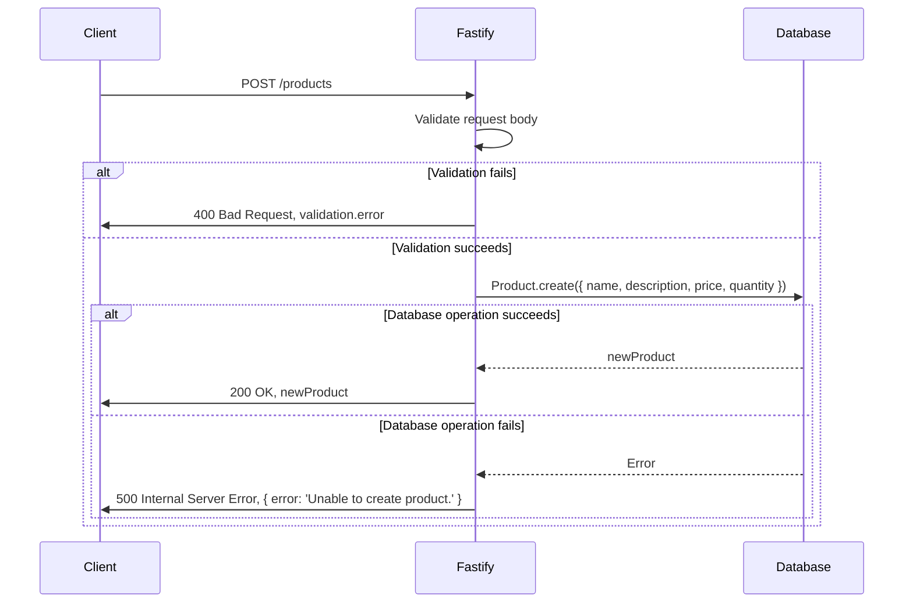
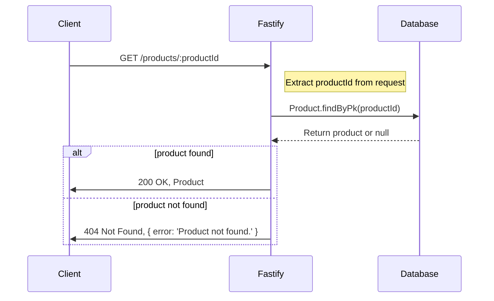
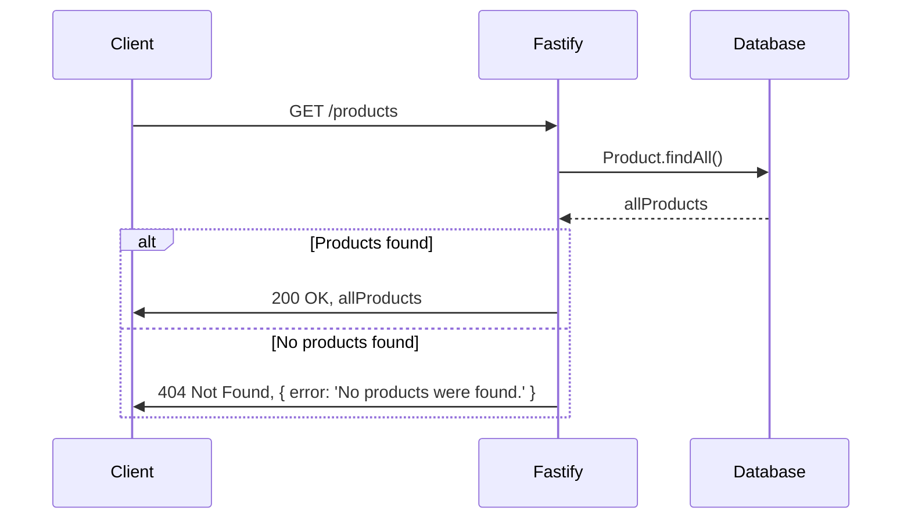
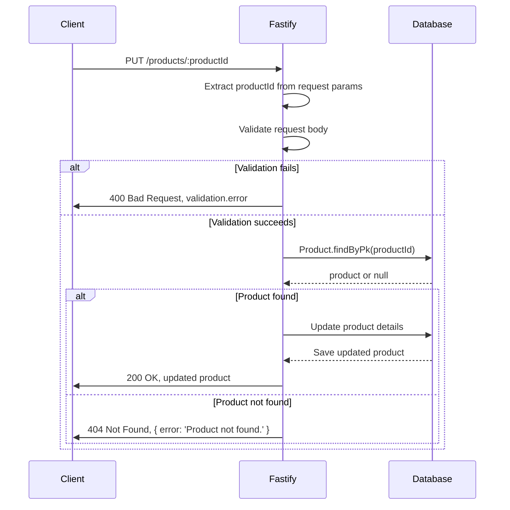

## Endpoints

### Create Product

```mermaid
sequenceDiagram
    participant Client
    participant Fastify
    participant Database

    Client->>Fastify: POST /products
    Fastify->>Fastify: Validate request body
    alt Validation fails
        Fastify->>Client: 400 Bad Request, validation.error
    else Validation succeeds
        Fastify->>Database: Product.create({ name, description, price, quantity })
        alt Database operation succeeds
            Database-->>Fastify: newProduct
            Fastify->>Client: 200 OK, newProduct
        else Database operation fails
            Database-->>Fastify: Error
            Fastify->>Client: 500 Internal Server Error, { error: 'Unable to create product.' }
        end
    end

```

### Get Product By ID

```mermaid
sequenceDiagram
    participant Client
    participant Fastify
    participant Database

    Client->>Fastify: GET /products/:productId
    Note right of Fastify: Extract productId from request
    Fastify->>Database: Product.findByPk(productId)
    Database-->>Fastify: Return product or null
    alt product found
        Fastify->>Client: 200 OK, Product
    else product not found
        Fastify->>Client: 404 Not Found, { error: 'Product not found.' }
    end
```

### Get All Products

```mermaid
sequenceDiagram
    participant Client
    participant Fastify
    participant Database

    Client->>Fastify: GET /products
    Fastify->>Database: Product.findAll()
    Database-->>Fastify: allProducts
    alt Products found
        Fastify->>Client: 200 OK, allProducts
    else No products found
        Fastify->>Client: 404 Not Found, { error: 'No products were found.' }
    end

```

### Update Product

```mermaid
sequenceDiagram
    participant Client
    participant Fastify
    participant Database

    Client->>Fastify: PUT /products/:productId
    Fastify->>Fastify: Extract productId from request params
    Fastify->>Fastify: Validate request body
    alt Validation fails
        Fastify->>Client: 400 Bad Request, validation.error
    else Validation succeeds
        Fastify->>Database: Product.findByPk(productId)
        Database-->>Fastify: product or null
        alt Product found
            Fastify->>Database: Update product details
            Database-->>Fastify: Save updated product
            Fastify->>Client: 200 OK, updated product
        else Product not found
            Fastify->>Client: 404 Not Found, { error: 'Product not found.' }
        end
    end
```
