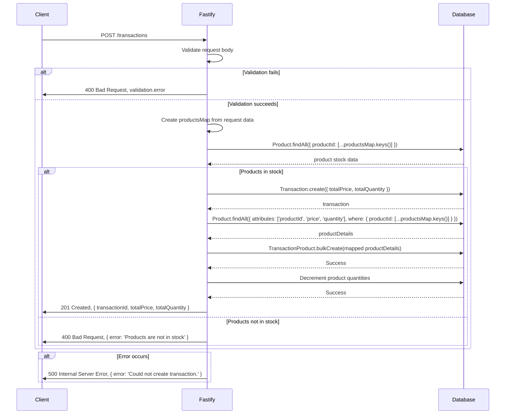
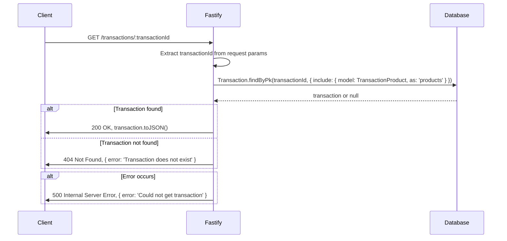

## Endpoints

### Create Transaction

```mermaid
sequenceDiagram
    participant Client
    participant Fastify
    participant Database

    Client->>Fastify: POST /transactions
    Fastify->>Fastify: Validate request body
    alt Validation fails
        Fastify->>Client: 400 Bad Request, validation.error
    else Validation succeeds
        Fastify->>Fastify: Create productsMap from request data
        Fastify->>Database: Product.findAll({ productId: [...productsMap.keys()] })
        Database-->>Fastify: product stock data
        alt Products in stock
            Fastify->>Database: Transaction.create({ totalPrice, totalQuantity })
            Database-->>Fastify: transaction
            Fastify->>Database: Product.findAll({ attributes: ['productId', 'price', 'quantity'], where: { productId: [...productsMap.keys()] } })
            Database-->>Fastify: productDetails
            Fastify->>Database: TransactionProduct.bulkCreate(mapped productDetails)
            Database-->>Fastify: Success
            Fastify->>Database: Decrement product quantities
            Database-->>Fastify: Success
            Fastify->>Client: 201 Created, { transactionId, totalPrice, totalQuantity }
        else Products not in stock
            Fastify->>Client: 400 Bad Request, { error: 'Products are not in stock' }
        end
    end
    alt Error occurs
        Fastify->>Client: 500 Internal Server Error, { error: 'Could not create transaction.' }
    end

```

### Get Transaction

```mermaid
sequenceDiagram
    participant Client
    participant Fastify
    participant Database

    Client->>Fastify: GET /transactions/:transactionId
    Fastify->>Fastify: Extract transactionId from request params
    Fastify->>Database: Transaction.findByPk(transactionId, { include: { model: TransactionProduct, as: 'products' } })
    Database-->>Fastify: transaction or null
    alt Transaction found
        Fastify->>Client: 200 OK, transaction.toJSON()
    else Transaction not found
        Fastify->>Client: 404 Not Found, { error: 'Transaction does not exist' }
    end
    alt Error occurs
        Fastify->>Client: 500 Internal Server Error, { error: 'Could not get transaction' }
    end
```
