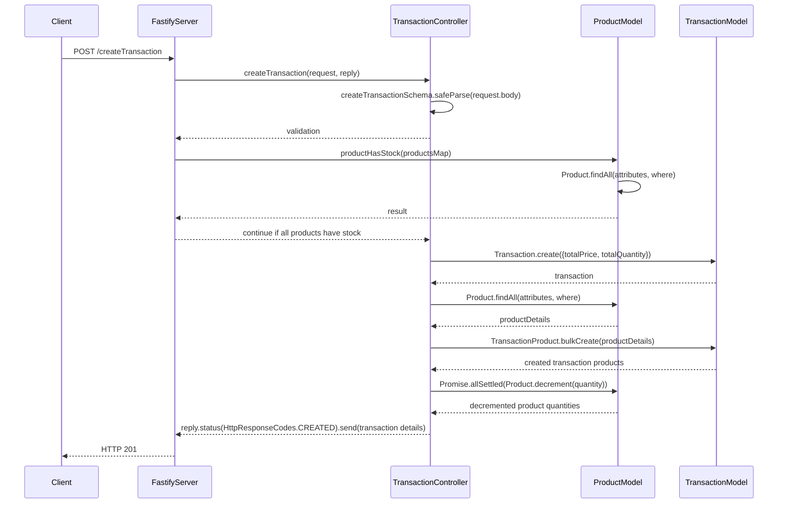
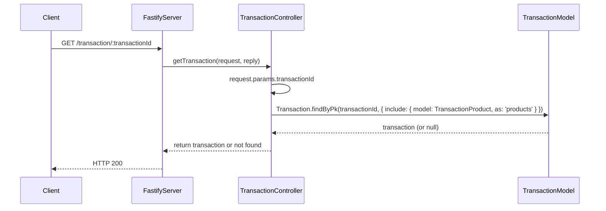

## Endpoints

### Create Transaction

```mermaid
sequenceDiagram
    participant Client
    participant FastifyServer
    participant TransactionController
    participant ProductModel
    participant TransactionModel

    Client->>FastifyServer: POST /createTransaction
    FastifyServer->>TransactionController: createTransaction(request, reply)
    TransactionController->>TransactionController: createTransactionSchema.safeParse(request.body)
    TransactionController-->>FastifyServer: validation
    FastifyServer->>ProductModel: productHasStock(productsMap)
    ProductModel->>ProductModel: Product.findAll(attributes, where)
    ProductModel-->>FastifyServer: result
    FastifyServer-->>TransactionController: continue if all products have stock
    TransactionController->>TransactionModel: Transaction.create({totalPrice, totalQuantity})
    TransactionModel-->>TransactionController: transaction
    TransactionController->>ProductModel: Product.findAll(attributes, where)
    ProductModel-->>TransactionController: productDetails
    TransactionController->>TransactionModel: TransactionProduct.bulkCreate(productDetails)
    TransactionModel-->>TransactionController: created transaction products
    TransactionController->>ProductModel: Promise.allSettled(Product.decrement(quantity))
    ProductModel-->>TransactionController: decremented product quantities
    TransactionController-->>FastifyServer: reply.status(HttpResponseCodes.CREATED).send(transaction details)
    FastifyServer-->>Client: HTTP 201

```

### Get Transaction By ID

```mermaid
sequenceDiagram
    participant Client
    participant FastifyServer
    participant TransactionController
    participant TransactionModel

    Client->>FastifyServer: GET /transaction/:transactionId
    FastifyServer->>TransactionController: getTransaction(request, reply)
    TransactionController->>TransactionController: request.params.transactionId
    TransactionController->>TransactionModel: Transaction.findByPk(transactionId, { include: { model: TransactionProduct, as: 'products' } })
    TransactionModel-->>TransactionController: transaction (or null)
    TransactionController-->>FastifyServer: return transaction or not found
    FastifyServer-->>Client: HTTP 200
```
