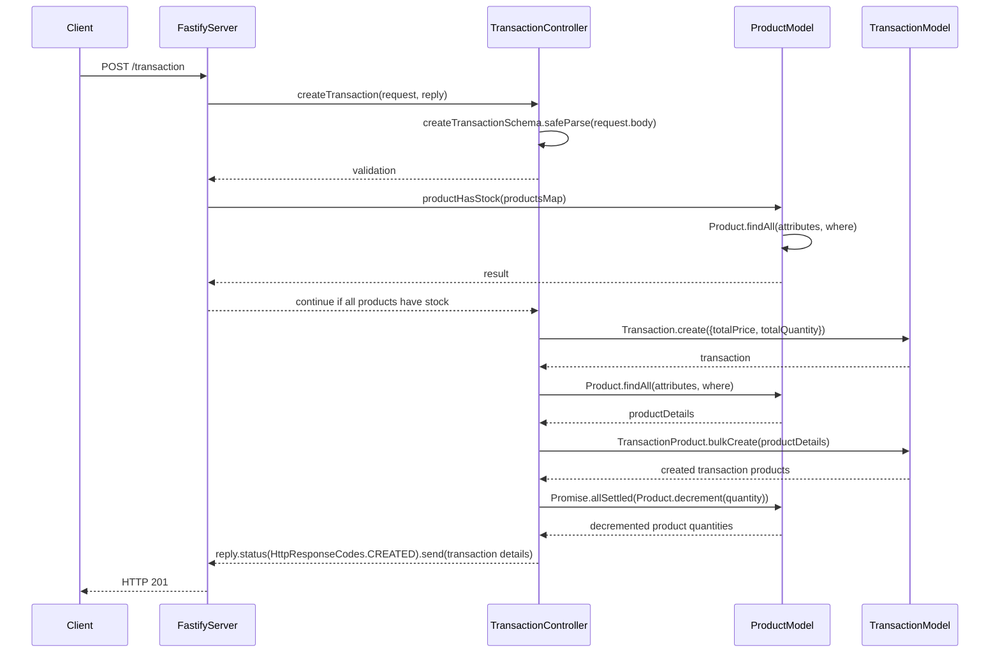
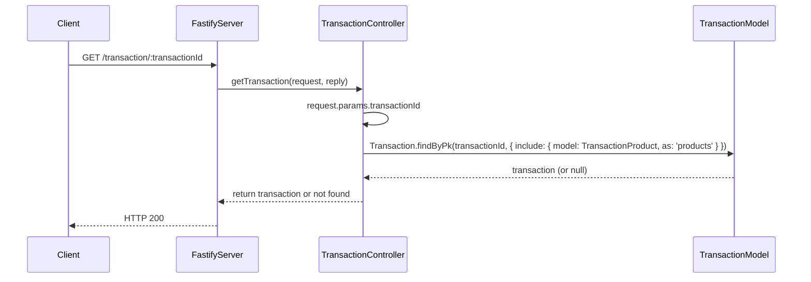

## Endpoints

### Create Transaction


#### API Details

- Endpoint: /transaction/
- Method: POST
##### Request Body:
```json
{
  "totalPrice": 36.00,
  "totalQuantity": 2,
  "products": [
    {
      "productId": 1,
      "quantity": 1
    },
    {
      "productId": 2,
      "quantity": 1
    }
  ]
}
```
##### Response:
```json
{
  "transactionId": 1,
  "totalPrice": "36.00",
  "totalQuantity": 2
}
```

### Get Transaction By ID


#### API Details

- Endpoint: /transaction/:transactionId
- Method: GET

##### Response:
```json
{
  "transactionId": 1,
  "totalPrice": "36.00",
  "totalQuantity": 2,
  "createdAt": "2024-06-24T05:43:31.000Z",
  "updatedAt": "2024-06-24T05:43:31.000Z",
  "products": [
    {
      "transactionProductId": 1,
      "productId": 2,
      "price": "15.00",
      "quantity": 1,
      "createdAt": "2024-06-24T05:43:31.000Z",
      "updatedAt": "2024-06-24T05:43:31.000Z",
      "transactionId": 1
    },
    {
      "transactionProductId": 2,
      "productId": 3,
      "price": "30.00",
      "quantity": 1,
      "createdAt": "2024-06-24T05:43:31.000Z",
      "updatedAt": "2024-06-24T05:43:31.000Z",
      "transactionId": 1
    }
  ]
}
```
