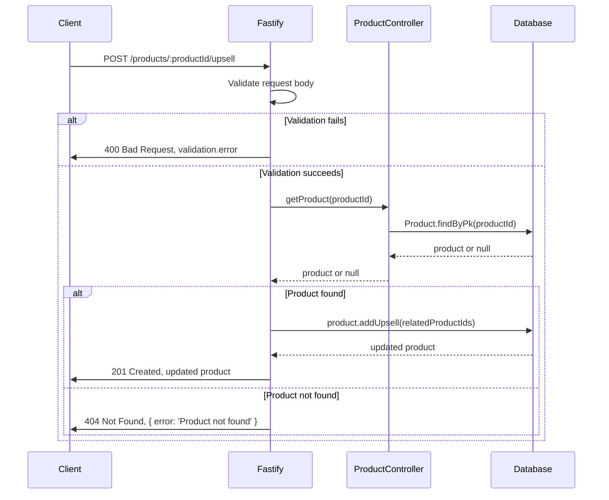
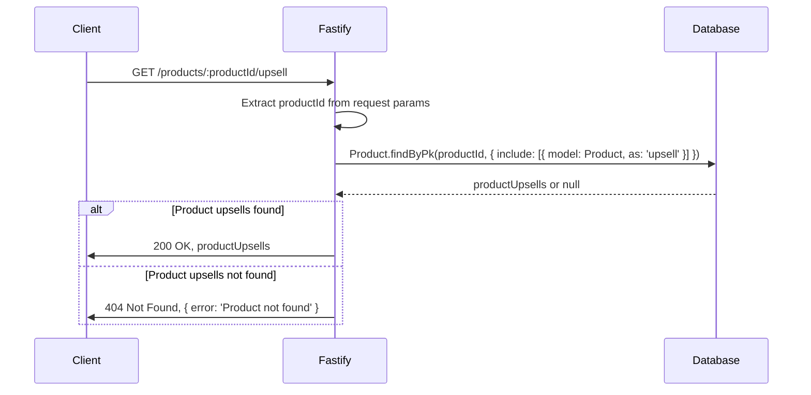
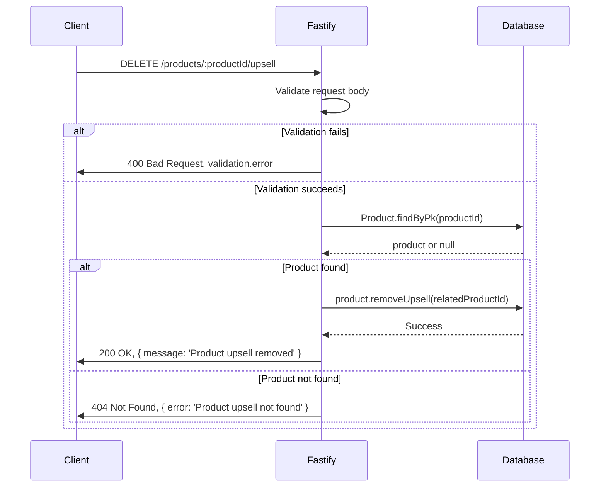

## Endpoints

### Add Product Upsell

```mermaid
sequenceDiagram
    participant Client
    participant Fastify
    participant ProductController
    participant Database

    Client->>Fastify: POST /products/:productId/upsell
    Fastify->>Fastify: Validate request body
    alt Validation fails
        Fastify->>Client: 400 Bad Request, validation.error
    else Validation succeeds
        Fastify->>ProductController: getProduct(productId)
        ProductController->>Database: Product.findByPk(productId)
        Database-->>ProductController: product or null
        ProductController-->>Fastify: product or null
        alt Product found
            Fastify->>Database: product.addUpsell(relatedProductIds)
            Database-->>Fastify: updated product
            Fastify->>Client: 201 Created, updated product
        else Product not found
            Fastify->>Client: 404 Not Found, { error: 'Product not found' }
        end
    end

```

### Get Product Upsells

```mermaid
sequenceDiagram
    participant Client
    participant Fastify
    participant Database

    Client->>Fastify: GET /products/:productId/upsell
    Fastify->>Fastify: Extract productId from request params
    Fastify->>Database: Product.findByPk(productId, { include: [{ model: Product, as: 'upsell' }] })
    Database-->>Fastify: productUpsells or null
    alt Product upsells found
        Fastify->>Client: 200 OK, productUpsells
    else Product upsells not found
        Fastify->>Client: 404 Not Found, { error: 'Product not found' }
    end

```

### Delete Product Upsell

```mermaid
sequenceDiagram
    participant Client
    participant Fastify
    participant Database

    Client->>Fastify: DELETE /products/:productId/upsell
    Fastify->>Fastify: Validate request body
    alt Validation fails
        Fastify->>Client: 400 Bad Request, validation.error
    else Validation succeeds
        Fastify->>Database: Product.findByPk(productId)
        Database-->>Fastify: product or null
        alt Product found
            Fastify->>Database: product.removeUpsell(relatedProductId)
            Database-->>Fastify: Success
            Fastify->>Client: 200 OK, { message: 'Product upsell removed' }
        else Product not found
            Fastify->>Client: 404 Not Found, { error: 'Product upsell not found' }
        end
    end

```
