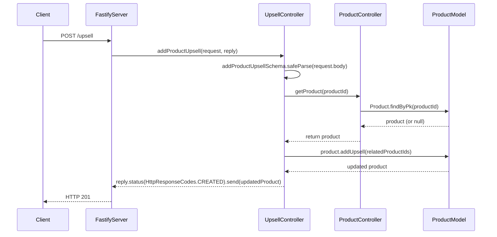
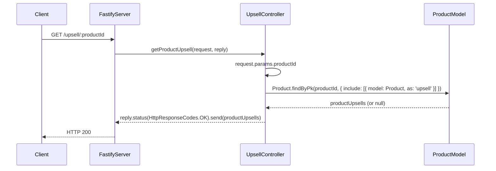
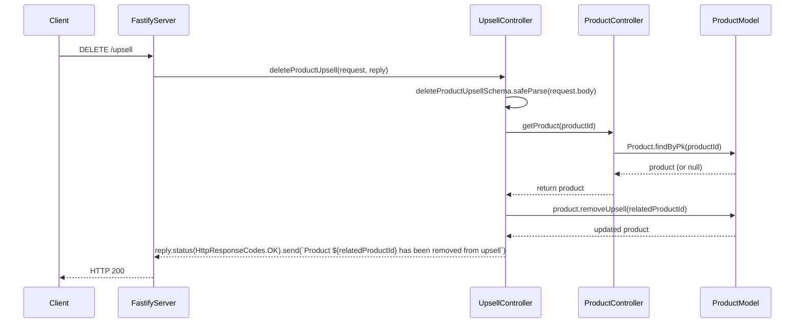

## Endpoints

### Add Product Upsell


#### API Details

- Endpoint: /upsell/
- Method: POST
##### Request Body:
```json
{
  "productId": 1,
  "relatedProductIds": [2, 3]
}
```
##### Response:
```json
{
  "productId": 1,
  "name": "bread",
  "description": "loaf of bread",
  "price": "15.00",
  "quantity": 2,
  "createdAt": "2024-06-23T08:19:51.000Z",
  "updatedAt": "2024-06-23T08:19:51.000Z"
}
```

### Get Product Upsell


#### API Details

- Endpoint: /upsell/:productId
- Method: GET
##### Response:
```json
{
  "productId": 1,
  "name": "bread",
  "description": "loaf of bread",
  "price": "15.00",
  "quantity": 2,
  "createdAt": "2024-06-23T08:19:51.000Z",
  "updatedAt": "2024-06-23T08:32:04.000Z",
  "upsell": [
    {
      "productId": 2,
      "name": "jam",
      "description": "jar of jam",
      "price": "20.00",
      "quantity": 1,
      "createdAt": "2024-06-23T08:19:51.000Z",
      "updatedAt": "2024-06-23T08:19:51.000Z"
    }
  ]
}
```

### Delete Product Upsell


#### API Details

- Endpoint: /upsell/:productId
- Method: DELETE

##### Response:
```
Product 2 has been removed from upsell
