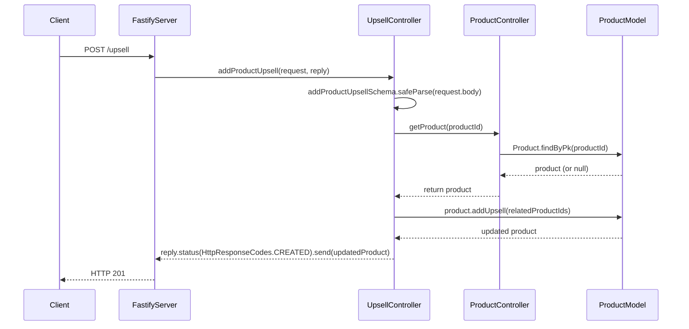
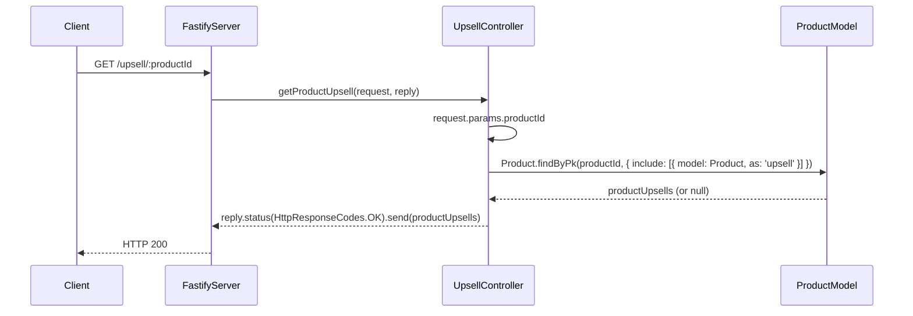
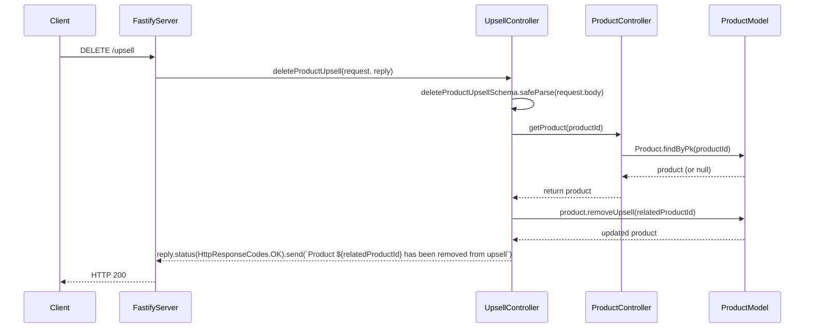

## Endpoints

### Add Product Upsell

```mermaid
sequenceDiagram
    participant Client
    participant FastifyServer
    participant UpsellController
    participant ProductController
    participant ProductModel

    Client->>FastifyServer: POST /upsell
    FastifyServer->>UpsellController: addProductUpsell(request, reply)
    UpsellController->>UpsellController: addProductUpsellSchema.safeParse(request.body)
    UpsellController->>ProductController: getProduct(productId)
    ProductController->>ProductModel: Product.findByPk(productId)
    ProductModel-->>ProductController: product (or null)
    ProductController-->>UpsellController: return product
    UpsellController->>ProductModel: product.addUpsell(relatedProductIds)
    ProductModel-->>UpsellController: updated product
    UpsellController-->>FastifyServer: reply.status(HttpResponseCodes.CREATED).send(updatedProduct)
    FastifyServer-->>Client: HTTP 201
```

### Get Product Upsell

```mermaid
sequenceDiagram
    participant Client
    participant FastifyServer
    participant UpsellController
    participant ProductModel

    Client->>FastifyServer: GET /upsell/:productId
    FastifyServer->>UpsellController: getProductUpsell(request, reply)
    UpsellController->>UpsellController: request.params.productId
    UpsellController->>ProductModel: Product.findByPk(productId, { include: [{ model: Product, as: 'upsell' }] })
    ProductModel-->>UpsellController: productUpsells (or null)
    UpsellController-->>FastifyServer: reply.status(HttpResponseCodes.OK).send(productUpsells)
    FastifyServer-->>Client: HTTP 200
```

### Delete Product Upsell

```mermaid
sequenceDiagram
    participant Client
    participant FastifyServer
    participant UpsellController
    participant ProductController
    participant ProductModel

    Client->>FastifyServer: DELETE /upsell
    FastifyServer->>UpsellController: deleteProductUpsell(request, reply)
    UpsellController->>UpsellController: deleteProductUpsellSchema.safeParse(request.body)
    UpsellController->>ProductController: getProduct(productId)
    ProductController->>ProductModel: Product.findByPk(productId)
    ProductModel-->>ProductController: product (or null)
    ProductController-->>UpsellController: return product
    UpsellController->>ProductModel: product.removeUpsell(relatedProductId)
    ProductModel-->>UpsellController: updated product
    UpsellController-->>FastifyServer: reply.status(HttpResponseCodes.OK).send(`Product ${relatedProductId} has been removed from upsell`)
    FastifyServer-->>Client: HTTP 200

```
