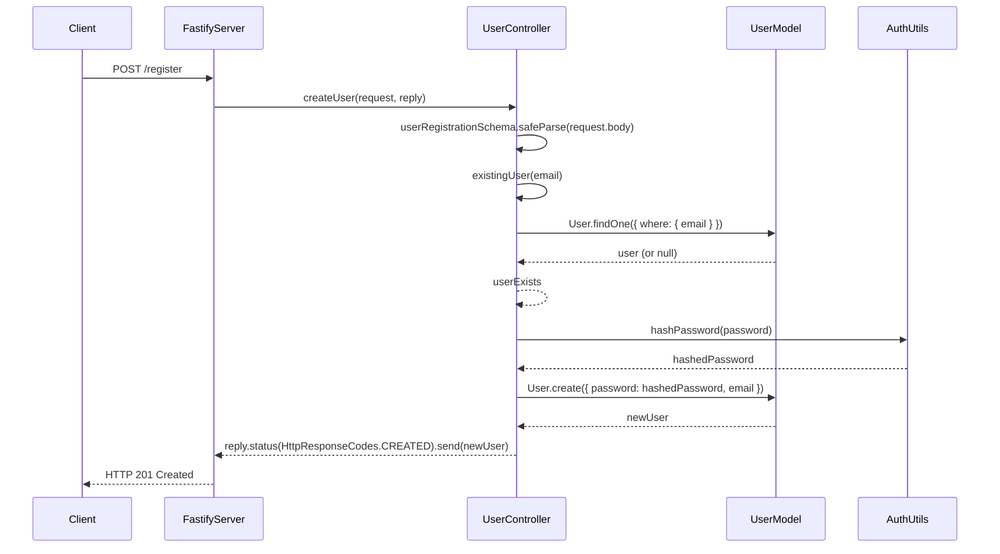
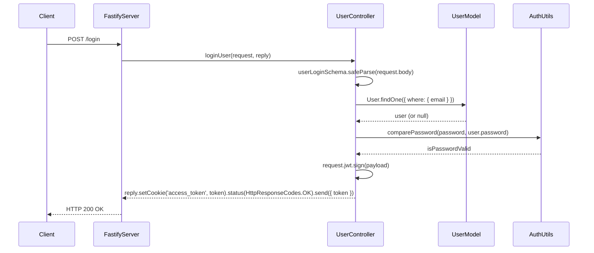
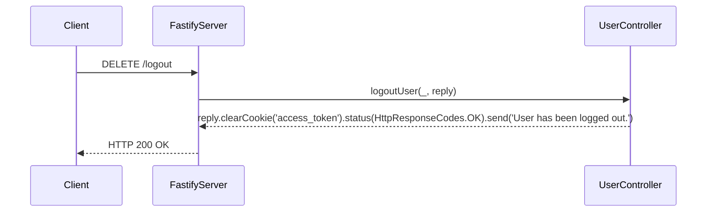

## Sequence Diagram
### Create User


### Login User


### Logout User


## API Details
### Authentication Endpoints
#### Register User
- Endpoint: /auth/register
- Method: POST
##### Request Body:
```json
{
"email": "string",
"password": "string"
}
```

##### Response:
```json
{
"id": 1,
"email": "string",
}
```

#### Login User
- Endpoint: /auth/login
- Method: POST
##### Request Body:
```json
{
"email": "string",
"password": "string"
}
```
##### Response:
```json
{
"token": "jwt_token_string"
}
```

#### Logout User
- Endpoint: /auth/logout
- Method: DELETE
##### Request Body:
```json
{}
```
##### Response:
```
User has been logged out.
```
