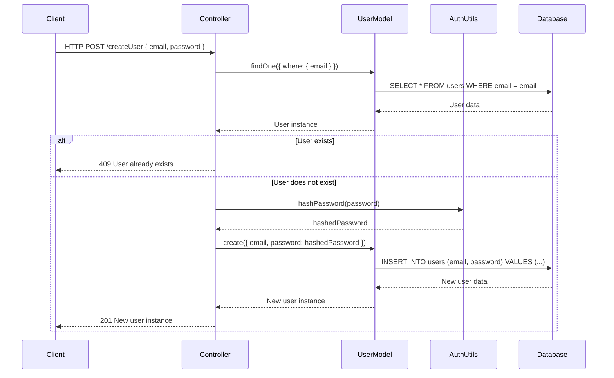
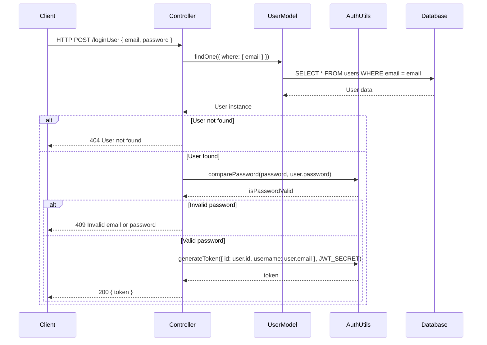

## Sequence Diagram
### Create User


### Login User


## API Details
### Authentication Endpoints
#### Register User
- Endpoint: /auth/register
- Method: POST
##### Request Body:
```json
{
"email": "string",
"password": "string"
}
```

##### Response:
```json
{
"id": 1,
"email": "string",
"createdAt": "date",
"updatedAt": "date"
}
```

#### Login User
- Endpoint: /auth/login
- Method: POST
##### Request Body:
```json
{
"email": "string",
"password": "string"
}
```
##### Response:
```json
{
"token": "jwt_token_string"
}
```
